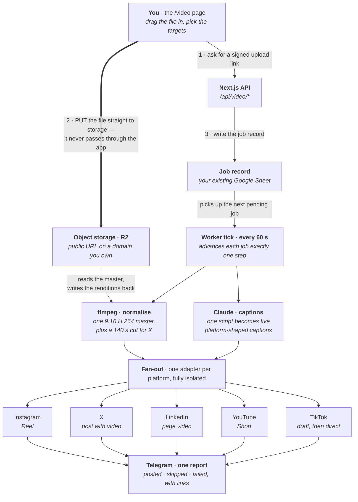
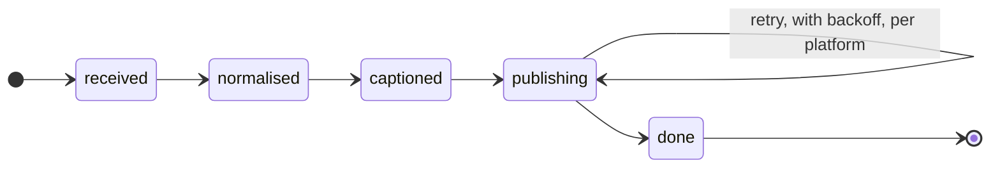

# The fan-out pipeline — in-house system design

**Companion to `multiplatform-video-upload-research.md`.** That document answers
*can we?*. This one answers *what do we build, and what does it feel like to use?*

The design principle: **you touch it once.** You drop one video on one page.
Everything after that is a queue, a worker and five adapters.

Two decisions do most of the work:

1. **The file goes straight from your browser to object storage** — never through the
   app server. That single choice removes upload size limits, request timeouts, and
   most of what would otherwise break.
2. **Every platform is one isolated adapter.** A dead TikTok token never stops Instagram.
   This is the same contract `lib/draws/publish.js` already uses.

---

## The whole system



Everything from the worker tick downwards runs unattended. You never open it.

---

## Why a worker, and not just five API calls

No two platforms upload the same way, and every one of them hands back a **job ticket,
not a result**. This is the single reason a plain request/response handler cannot do it.

| Platform | The sequence | Waits |
|---|---|---|
| **Instagram** | create container → *poll status* → `media_publish` | 1 |
| **X** | INIT → APPEND ×n → FINALIZE → *poll processing* → post tweet | 1 |
| **LinkedIn** | `initializeUpload` → PUT 4 MB parts → `finalizeUpload` → *poll AVAILABLE* → create post → *poll lifecycle* | 2 |
| **YouTube** | resumable init → PUT chunks → private, then public once audited | 0 |
| **TikTok** | `creator_info` → init from URL → *poll status* → lands in your inbox | 1 |

At every *poll* step the worker **parks the job and returns** — it never blocks. The next
tick resumes it. LinkedIn is the longest at six calls and two separate waits, which is
why it gets written last, not first.

## Why this survives redeploys



Every tick picks up a job **in whatever state it is in**, advances it one step, and
writes the new state back. Nothing is held in memory between steps.

So a crash, a Render redeploy, a rate limit or an expired token just means the next tick
picks up where the last one stopped — and **a platform that already returned a post ID is
never retried.** This is exactly how the draws poster already avoids double-posting.

---

## The front door: three options, one winner

| Front door | Verdict | How it feels | The catch |
|---|---|---|---|
| **A page in this app** | **Recommended** | Open `/video` on your phone, drag the file in, tap Publish | None that matters — needs a signed-upload endpoint, about thirty lines |
| **Telegram bot** | **Can't work** | Send the video to your bot; by far the nicest thing to use on a phone | **Bots can only download files up to 20 MB.** A 3-minute vertical video is typically 40–100 MB. No workaround short of self-hosting a Telegram API server |
| **Google Drive folder** | Good later | Share to a Drive folder from your phone's share sheet | Adds a polling step and a copy into R2 before anything can post. A good second door, not the first |

Telegram still earns its place — on the **other** end. It is where the report lands, where
a token-expiry warning reaches you, and where an optional "approve before it goes out"
button can live. *Sending* is unlimited; only *receiving* a large file is capped.

---

## What using it actually looks like

1. **Open `/video`, drop the file.** Upload starts immediately, straight to storage, with
   a progress bar. 60 MB on decent wifi ≈ 15 seconds.
2. **Read the five captions, edit anything.** Claude drafts them from the video's script —
   Farsi and English, sized per platform. Tick or untick platforms. *This is the only
   screen with choices on it — about 60 seconds.*
3. **Tap Publish, or Schedule.** "Schedule" writes a run-at time; the same worker picks it
   up then. Nothing else differs.
4. **Close the tab.** Two to five minutes later Telegram tells you what posted, with a link
   to each, and names anything that failed and why.

---

## What has to be added

**New, outside the repo — an R2 bucket on your own domain.** Instagram fetches your file
from a public URL, and TikTok only accepts URLs on a domain it has verified you own. A
custom domain on the bucket satisfies both. Roughly free at this volume.

**New, one line — ffmpeg in the Dockerfile.** The image is `node:20-slim`, which has no
ffmpeg:

```dockerfile
RUN apt-get update && apt-get install -y --no-install-recommends ffmpeg \
    && rm -rf /var/lib/apt/lists/*
```

**New, in the repo:**

```
lib/video/
  store.js        job records — the Library-tab pattern you already use
  normalize.js    ffmpeg: 9:16 H.264/AAC master (+ 140 s cut when X is a target)
  media.js        signed PUT urls, public read urls, 30-day cleanup
  captions.js     one script becomes five platform-shaped captions
  targets/        instagram.js  x.js  linkedin.js  youtube.js  tiktok.js
  run.js          the tick: advance one step, write state back, never throw

app/api/video/upload-url/route.js   hand the browser a signed PUT
app/api/video/jobs/route.js         create a job / list recent jobs
app/api/video/status/route.js       setup self-check, like /api/draws/status
app/video/page.jsx                  drop the file, edit captions, publish
```

Every adapter returns the shape the existing publisher already uses:

```
publish(job) → { ok, skipped?, reason?, id?, error? }   // never throws
```

**Reused, already yours:** the self-scheduler (`instrumentation.js` +
`lib/draws/scheduler.js`), the Google Sheet store, Telegram alerting, and the X,
LinkedIn and Instagram credentials. `LINKEDIN_ORG_ID` is already set, so page posting is
already authorised — worth confirming the token carries the video scope, but the hard
part is done.

---

## Build order

Each phase ends with something usable, and nothing later depends on an approval landing.

| # | Phase | Effort | Result |
|---|---|---|---|
| 1 | **The spine, plus Instagram** — storage, signed uploads, job record, tick, upload page, one adapter | ≈3 days | You can post Reels from your phone |
| 2 | **X and LinkedIn** — two more adapters against an interface that exists; ffmpeg enters here for the 140 s cut | ≈2 days | Three platforms live, no approvals used |
| 3 | **YouTube, shipped private on day one** — write it, let it post private, file the audit that afternoon | ≈2 days, then Google's clock | One field flips to public when it clears |
| 4 | **TikTok as a draft, then direct** — the no-audit draft path first; submit for the audit in parallel | ≈1 day, audit in background | Same adapter switches to direct when it passes |

## The one open question

**Does the X account have Premium?** Without it, X refuses anything over 140 seconds, so
the pipeline must cut a shorter version — the difference between ffmpeg arriving in
phase 2 or being optional entirely. Everything else in this plan holds either way.
